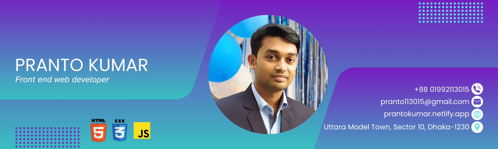

<!--Banar Section Start-->

<!--Banar Section End-->

<!--Title & Typography Section End-->
<h1 align="center">Hi ,I'm a Front-End Developer</h1>

<!--Title & Typography Section End-->

<!--pofiel view Section start-->

  

<!--pofiel view Section end-->

<!-- Header subtitle area start -->
<h3 align="center">My  passion is Front-end Developer</h3>

I'm Pranto, a <b>Front-End Developer</b>  and Graphics Designer from Bangladesh. I accomplished the 4 years Diploma-in engineering of Computer Science and Technology at Bogura Polytechnic Institute, Bogura. I Spend most of time coding outstanding projects or Creative Design. In terms of experience, I have served as a Campus Ambassador at Creative IT Institute. During my time there from March 2022 to April 2023. 

Throughout my academic journey, I have participated in Goverment Training Skill Development for Mobile Game & Application Project (UX/UI Design), ICT Division. 

I have a strong command of programming languages such as C, C++, Java and JavaScript. I am proficient in concepts related to Data Structures and Algorithms (DSA) and Object-Oriented Programming (OOP). Additionally, I have hands-on experience with technologies and tools like HTML, CSS, Bootstrap, jQuery, Java Script and MySQL.

<!-- Header subtitle area end -->

<!--Body Right Section start-->

<!--Body Right Section End-->

<!--Body Left Section Start-->
- 👨‍🎓 I’m currently a Student at **[IUBAT University](https://iubat.edu/)**

- 📚 I’m currently learning **[BCSE](https://cse.iubat.edu/)**

- 👨‍💻 I'm currently working **Front-End Development**

- 💬 Ask me about **Web Related**

- 📫 How to reach me **pranto113015@gmail.com**

- ⚡ Fun fact **I am funny**
<!--Body Left Section End-->

<!--Connect with me Section Start-->
<h3 align="left">&#128073; Connect with me :</h3>

<!--Connect with me Section End-->

<!-- Developer Hub section start -->
<h3 align="left">&#128187; Development Hub :</h3>
 > Progamming languages :
<table>
  <tr>
    <td align="center" width="96">
      
       C
    </td>
    <td align="center" width="96">
      
       C++
    </td>
     <td align="center" width="96">
      
       Java
    </td>
         <td align="center" width="96">
      
       PHP
    </td>
    </td>
         <td align="center" width="96">
      
       Java Script
    </td>
    <td align="center" width="96">
      
       HTML5
    </td>
    <td align="center" width="96">
      
       CSS3
    </td>
  </tr>
</table>

> Frameworks and libraries :
<table>
  <tr>
    <td align="center" width="96">
      
       Bootstrap
    </td>
    <td align="center" width="96">
      
       React
    </td>
    </tr>
</table>

> Software and Tools  :
<table>
  <tr>
    <td align="center" width="96">
      
       git
    </td>
     <td align="center" width="96">
      
       Adobe Photoshop
    </td>
    <td align="center" width="96">
      
       Adobe Illustratorar
    </td>
    <td align="center" width="96">
      
       Visual Studio
    </td>
    </tr>
</table>

> Databases and cloud hosting :
<table>
  <tr>
    <td align="center" width="96">
      
       SQL
    </td>
    <td align="center" width="96">
      
       MySQL
    </td>
    </tr>
</table>

<!-- Developer Hub section end -->

<!--Certification Section Start-->
<h3 align="left">	&#174; Certifications :</h3>
<code></code>
<code></code>
<code></code>
<code></code>
<!--Certification Section end-->

&nbsp;

