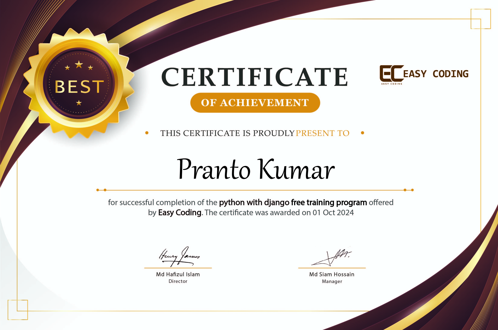

<!--Banar Section Start-->

<!--Banar Section End-->

<!--Title & Typography Section End-->
<h1 align="center">Hi ,I'm a Front-End Developer</h1>

    
<!--Title & Typography Section End-->

<!--pofiel view Section start-->

  

<!--pofiel view Section end-->

<!-- Header subtitle area start -->
<h3 align="center">My passion is front-end developer</h3>

I'm Pranto, a <b>Front-End Developer</b>  and Graphics Designer from Bangladesh. I accomplished the 4 years Diploma-in engineering of Computer Science and Technology at Bogura Polytechnic Institute, Bogura. I Spend most of time coding outstanding projects or Creative Design. In terms of experience, I have served as a Campus Ambassador at Creative IT Institute. During my time there from March 2022 to April 2023.

Throughout my academic journey, I have participated in Goverment Training Skill Development for Mobile Game & Application Project (UX/UI Design), ICT Division.

I have a strong command of programming languages such as C, C++, Java and JavaScript. I am proficient in concepts related to Data Structures and Algorithms (DSA) and Object-Oriented Programming (OOP). Additionally, I have hands-on experience with technologies and tools like HTML, CSS, Bootstrap, jQuery, Java Script and MySQL.

<!-- Header subtitle area end -->

<!--Body Right Section start-->

<!--Body Right Section End-->

<!--Body Left Section Start-->

- 👨‍🎓 I’m currently a Student at **[IUBAT University](https://iubat.edu/)**

- 📚 I’m currently learning **[BCSE](https://cse.iubat.edu/)**

- 👨‍💻 I'm currently working **Front-End Web Development**

- 💬 Ask me about **Web Related**

- 📫 How to reach me **<pranto113015@gmail.com>**

- ⚡ Fun fact **So much discus do when i learn new skills**
<!--Body Left Section End-->

<!--Connect with me Section Start-->
<h3 align="left"> 🌐 Connect with me :</h3>

<!--Connect with me Section End-->

### 💼 Experience

| Position         | Institute             | Duration           | Location               |
| ---------------- | --------------------- | ------------------ | ---------------------- |
| Campus Ambasador | Creative IT Institute | Nov 2023 - Running | Dhanmondi, Dhaka- 1205 |

<!-- Developer Hub section start -->
<h3 align="left">&#128187; Development Hub / Skills :</h3>

**Progamming languages :**

**Frameworks & Libraries :**

**Software and Tools :**

**Databases and cloud hosting :**

<!-- Developer Hub section end -->

### 📘 Education

1. B.Sc. in Computer Science & Engineering (Running) at
   IUBAT University  
   Uttara Model Town Dhaka, Bangladesh.

2. Diploma in Computer Science & Technology  
   Bogura Polytechnic Institute ,Bogura.

<!--Certification Section Start-->
<h3 align="left" > 👨🏻‍🎓&nbsp;Certifications :</h3>
<code></code>
<code></code>
<code></code>
<code></code>
<code></code>
<code></code>
<code></code>
<code></code>
<!--Certification Section end-->

### 🎯 Sports / Game / Activities / Hobby

- 🏸 Badminton
- 🏃‍♂️ Running
- 🚶‍♂️ Walking
- ✈️ Travelling
- 🌳 Gardening

### 🏅 Honors & Awards

- 100% Scholarship Freelancing of Adobe Photoshop Certified Course at Creative It Institute, Dhaka.

### 📊 GitHub Stats

&nbsp;

<!-- footer section start -->

 Thanks for going through my personal Portfolio .
All rights reserved by :blue_heart: <a href="https://www.linkedin.com/in/pranto-kumar-a326801b3/">Pranto Kumar</a> @ 2019 - 2024 

<!-- footer section end -->
