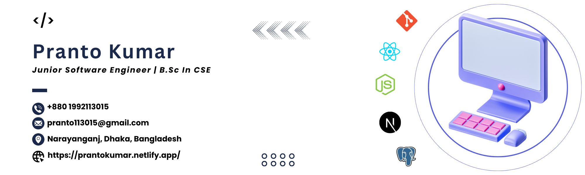

<!--Banar Section Start-->

<!--Banar Section End-->

<!--Title & Typography Section End-->
<h1 align="center">Hi ,I'm a Front-End Web Developer</h1>

    
<!--Title & Typography Section End-->

<!--pofiel view Section start-->

  

<!--pofiel view Section end-->

<!-- Header subtitle area start -->
<section>
  <h3 align="center">💻 Passionate about coding, creating, and continuous learning.</h3>

  

    I'm <strong>Pranto Kumar</strong>, a <strong>Front-End Developer</strong> from Bangladesh. I completed a 4-year Diploma in Computer Science and Technology at <strong>Bogura Polytechnic Institute</strong>. I spend most of my time coding innovative projects.
  

  

    I served as a <strong>Campus Ambassador</strong> at <strong>Creative IT Institute</strong> from November 2022 to June 2025. Throughout my academic journey, I participated in government skill development training under the <strong>Mobile Game & Application Project (UX/UI Design)</strong> organized by the ICT Division.
  

  

    I also completed an 80-hour training on <strong>Web Development Essentials</strong>, conducted by the Department of Computer Science and Engineering (CSE), Jagannath University, from October 2024 to May 2025, under the <strong>Enhancing Digital Government and Economy (EDGE) Project</strong> of the Bangladesh Computer Council, ICT Division.
  

  

    I have strong command over programming languages like <strong>C, C++ and JavaScript</strong>, and am proficient in <strong>Data Structures & Algorithms (DSA)</strong> and <strong>Object-Oriented Programming (OOP)</strong>. Additionally, I have hands-on experience with technologies and tools such as <strong>HTML, CSS, Tailwind CSS, Bootstrap, JavaScript, React.js and Next.js</strong>.
  

</section>

<!-- Header subtitle area end -->

<!--Body Right Section start-->

<!--Body Right Section End-->

<!--Body Left Section Start-->

- 👨‍🎓 I’m currently a Student at **[IUBAT University](https://iubat.edu/)**

- 📚 I'm currently studying of the department **[BCSE](https://cse.iubat.edu/)**

- 👨‍💻 I'm currently working **Front-End Development React.js and Next.js**

- 💬 Ask me about **Web Related**

- 📫 How to reach me **<pranto113015@gmail.com>**

- ⚡ Fun fact **So much discus do when i learn new skills**
<!--Body Left Section End-->

<!--Connect with me Section Start-->
<h3 align="left"> 🌐 Connect with me :</h3>

<!--Connect with me Section End-->

## 💼 Experience

| Position               | Institute             | Duration             | Location                | Credential ID / Link                                                                                   |
| ---------------------- | --------------------- | -------------------- | ----------------------- | ------------------------------------------------------------------------------------------------------ |
| Campus Ambassador      | Creative IT Institute | Nov 2022 - Jun 2025  | Dhanmondi, Dhaka - 1205 | [View Certificate](https://drive.google.com/file/d/1Ov0Vjtw5AJhgdktFKng0FHgJNqS25J3r/view?usp=sharing) |
| Web Developer (Intern) | Alpha Net             | Sept 2025 - Dec 2025 | Nikunja 2, Dhaka - 1229 | [View Certificate](#)                                                                                  |

#### 🎯 Campus Ambassador – Key Achievements

- 🗣️ Represented the institute at university and tech events, promoting IT training programs
- 📢 Organized and hosted workshops, seminars, and info sessions
- 🤝 Strengthened communication, teamwork, and public speaking skills
- 🌐 Built awareness of tech education among students across various campuses

<!-- Developer Hub section start -->

## 🧰 Tech Stack

**Core Progamming languages :**

**Frondend Frameworks & Libraries :**

**Backend :**

**Databases and cloud hosting :**

**Software and Tools :**

<!-- Developer Hub section end -->

## 🎓 Education

#### 💻 B.Sc. in Computer Science & Engineering (CSE)

**IUBAT – International University of Business Agriculture and Technology** , Sector-10, Uttara Model Town, Dhaka-1230, Bangladesh  
📅 **Duration:** 2022 – 2025 (4 Years)  
🎯 **CGPA:** 3.54 (Out of Scale 4.00)  
📚 **Status:** Completed

- Studying core areas including algorithms, databases, software engineering, and web technologies
- Actively participating in academic projects and development-focused coursework

#### 💻 Diploma in Computer Science & Technology

**Bogura Polytechnique Institute**, Bogura, Rajshahi, Bangladesh  
📅 **Duration:** 2016 – 2020 (4 Years)  
🎯 **CGPA:** 3.83 (Out of Scale 4.00)  
📚 **Status:** Completed

- Specialized in software development, data structures, networking, and system design
- Gained strong hands-on experience through practical labs and real-world projects

<!--Certification Section Start-->

## 👨🏻‍🎓 Certifications & Training

| Licenses & Certifications              | Issuing Organization                                                         | Year | Credential ID / Link                                                                                   |
| -------------------------------------- | ---------------------------------------------------------------------------- | ---- | ------------------------------------------------------------------------------------------------------ |
| Web Development Essentials             | EDGE Project of the Bangladesh Computer Council (BCC) Under the ICT Division | 2025 | [View Certificate](https://drive.google.com/file/d/1hfVl_0NC8RY_IMV9fdnNX07inpo1GgU0/view?usp=sharing) |
| Master Git and Github                  | udemy                                                                        | 2024 | [View Certificate](https://drive.google.com/file/d/12azxDov7E5Voh8fmi78sE6U1xdO1yI0V/view?usp=sharing) |
| Full Stack Development with MERN       | CodersTrust and GpAcademy                                                    | 2024 | [View Certificate](https://drive.google.com/file/d/1wzX6Ow0pqbqSk0MLMwVC-T03FJOyJgci/view)             |
| Front-end Development using JavaScript | IUBAT University Department of Computr Science and Engineering (CSE)         | 2023 | [View Certificate](https://drive.google.com/file/d/14xZQfgzZRoIbJkjL9CVDCRbbgEv0Q46J/view?usp=sharing) |
| Adobe Photoshop                        | Creative IT Institute, Uttara Campus, Dhaka.                                 | 2022 | [View Certificate](https://drive.google.com/file/d/1Eh08IYEeQBPdk2l-9zzB3IncnpMRJWuG/view)             |
| UX/UI Design                           | Skill Development for Mobile Game & Application Project, ICT Division        | 2018 | [View Certificate](https://drive.google.com/file/d/1xJQvLMxoo-VEGTBDPvlwwdvmUUG_VFLO/view)             |

<!--Certification Section end-->

## 🎯 Interests & Activities

<section>
  

    <strong>Sports & Fitness:</strong> 🏸 Badminton | 🏃‍♂️ Running | 🚶‍♂️ Walking 
    <strong>Leisure & Lifestyle:</strong> ✈️ Travelling | 🌳 Gardening
  

</section>

## 🏅 Honors & Awards

<section>
  

    <strong>🎓 100% Scholarship</strong> – Freelancing & Adobe Photoshop Certified Course, Creative IT Institute, Dhaka
  

</section>

## 💡 Quote of the Day

  <em>“Every error is an opportunity to learn. Don't be afraid to make mistakes; they're part of the coding process.”</em>  
    
  <strong> — Pranto Kumar</strong>

## 📊 GitHub Stats

&nbsp;

  

<!-- footer section start -->

Thanks for going through my personal Portfolio | All rights reserved by ❤️ <a href="https://www.linkedin.com/in/pranto-kumar-a326801b3/">Pranto Kumar</a> © 2019 - 2026

<!-- footer section end -->
